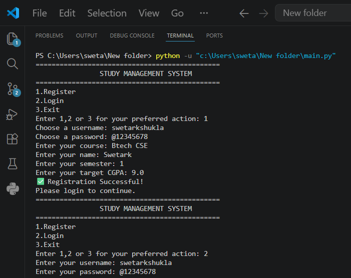
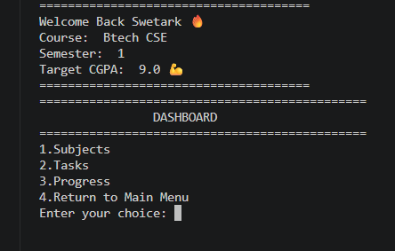
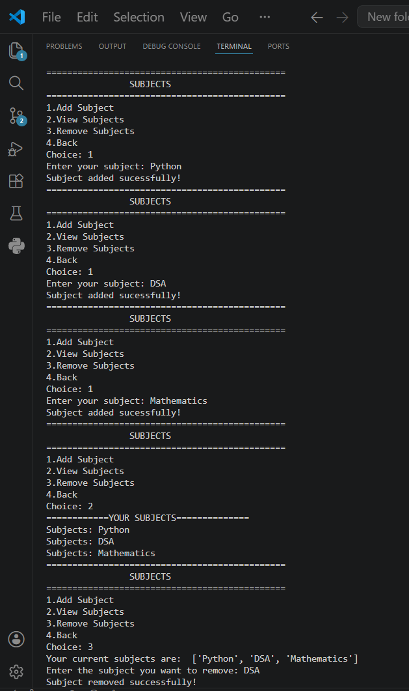
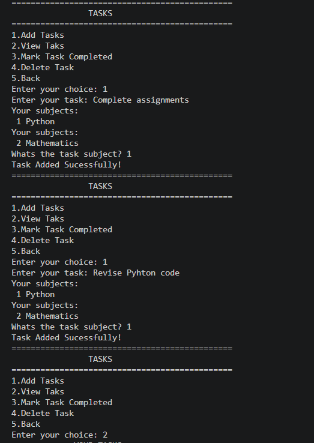
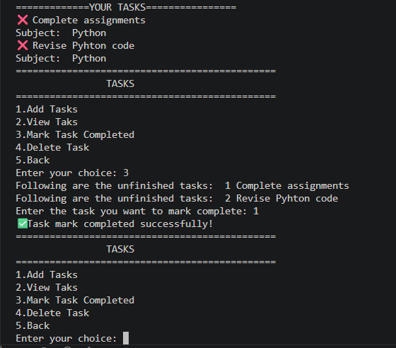
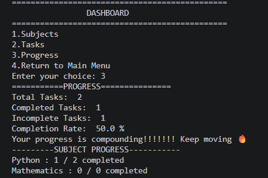

# 📚 Study Management System

A console-based Study Management System built with Python to help students organize their academic work efficiently.

The application allows users to register, log in, manage subjects, create study tasks, track their progress, and save all their data using JSON files.

---

## ✨ Features

- 🔐 User Registration & Login
- 💾 SQLite Database Storage
- 📚 Add, View & Remove Subjects
- ✅ Add, View, Complete & Delete Tasks
- 📊 Progress Dashboard
- 📈 Subject-wise Progress Tracking
- 🎯 Completion Percentage
- 🚫 Duplicate Username & Subject Detection

## 🛠️ Tech Stack

- Python
- SQLite3
- Git
- GitHub

---
## 🗄️ Database Design

The project uses SQLite with three tables:

- Users
- Subjects
- Tasks

Relationships:

Users (1) ──────< Subjects

Users (1) ──────< Tasks

# Project Structure

Study-Management-System/
│
├── auth.py
├── dashboard.py
├── subjects.py
├── tasks.py
├── progress.py
├── database_setup.py
├── study.db
├── README.md
├── LICENSE
└── screenshots/
---
## 📸 Screenshots

### 🏠 Main Menu

---

### 🔐 Login

---

### 📚 Subject Management

---

### ✅ Task Management

---

### 📊 Progress

---

## 🔮 Future Improvements

- SQLite database integration
- Flask web application
- Study streak system
- Task priorities
- Search and filter tasks
- Password hashing
- Deadline support
- Due dates
- Search tasks
- Email reminders

---

## 📚 What I Learned

This project was my first complete database-driven application. While building it, I learned:

- How to replace in-memory Python lists with a SQLite database.
- How to design database tables and relationships.
- How to write SQL queries for inserting, retrieving, updating, and deleting data.
- How to organize a larger Python project into separate modules.
- How to debug real-world programming problems instead of only syntax errors.
- How to document and publish a project professionally using Git and GitHub.
---

## 👨‍💻 Author

**Swetark Shukla**

GitHub: https://github.com/swetarkshukla

---

## 📜 License

This project is licensed under the MIT License.